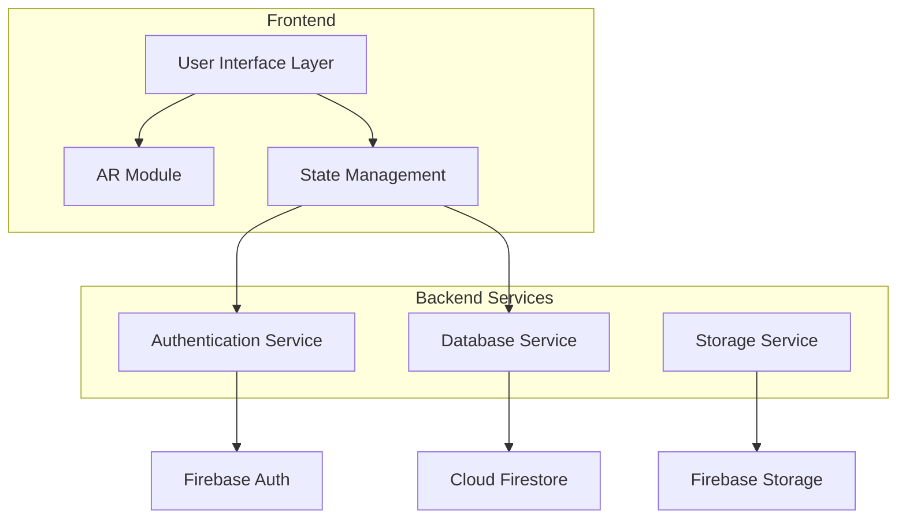
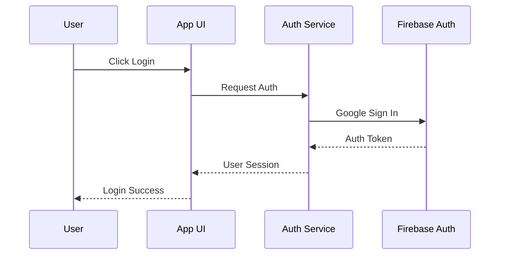
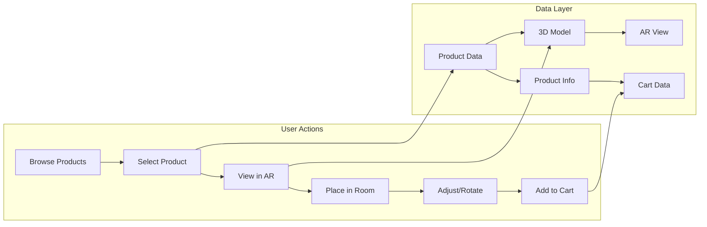
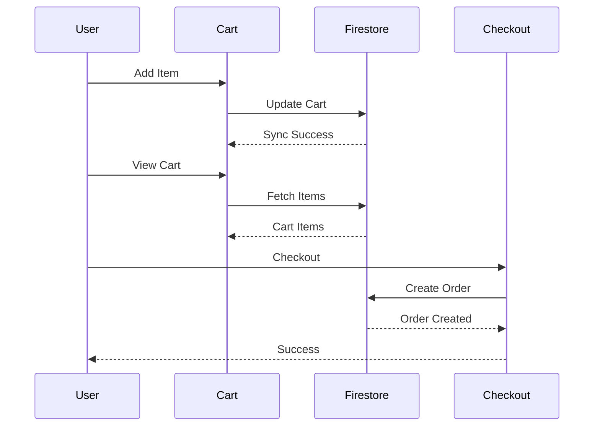
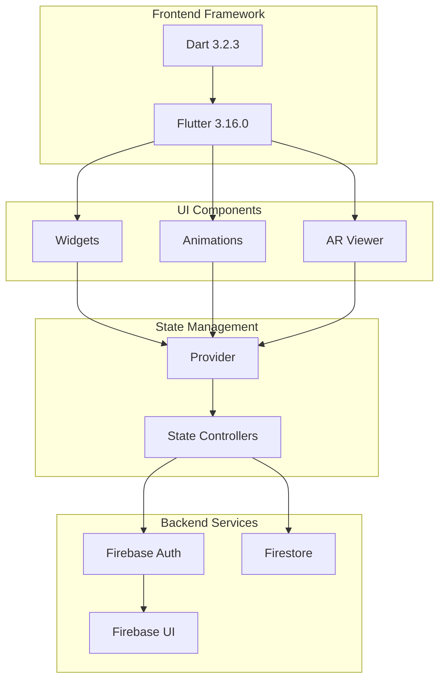

# 🛋️ AR Furniture App

[](https://opensource.org/licenses/MIT)
[](https://flutter.dev/)
[](https://dart.dev/)
[](https://firebase.google.com/)

AR Furniture App is an e-commerce application that helps users shop for furniture by viewing products in their own space using AR technology. The app combines a simple shopping experience with real-time 3D visualization, allowing users to see how furniture fits and looks in their home before buying.

## 📑 Table of Contents
- [🛋️ AR Furniture App](#️-ar-furniture-app)
  - [📑 Table of Contents](#-table-of-contents)
  - [✨ Features](#-features)
  - [🔧 Requirements](#-requirements)
  - [📂 Directory Structure](#-directory-structure)
  - [🚀 Installation \& Setup](#-installation--setup)
  - [📦 Dependencies](#-dependencies)
  - [🏗️ System Architecture](#️-system-architecture)
    - [Overall System Architecture](#overall-system-architecture)
    - [Authentication Flow](#authentication-flow)
    - [Product \& AR Flow](#product--ar-flow)
    - [Shopping Cart Flow](#shopping-cart-flow)
    - [Technical Stack Details](#technical-stack-details)
  - [🔮 Future Enhancements](#-future-enhancements)
  - [📱 Screenshots](#-screenshots)
    - [Onboarding Experience](#onboarding-experience)
    - [Authentication](#authentication)
    - [Product Browsing](#product-browsing)
    - [Product Details \& AR View](#product-details--ar-view)
    - [Shopping Cart](#shopping-cart)
  - [📄 License](#-license)

## ✨ Features
- User authentication with Google Sign-in
- Interactive onboarding experience
- AR visualization of furniture
- Product catalog with search functionality
- Shopping cart management
- Real-time data synchronization with Firebase
- Secure checkout process

## 🔧 Requirements
- Flutter SDK (>=3.2.3 <4.0.0)
- Dart SDK (>=3.2.3 <4.0.0)
- Firebase account and project setup
- Android Studio / VS Code
- Git

## 📂 Directory Structure
```
ar_furniture_app/
├── android/               # Android-specific files
├── ios/                  # iOS-specific files
├── assets/
│   ├── models/          # 3D model files (.glb)
│   ├── products/        # Product images
│   ├── screenshot/      # App screenshots
│   └── logo.png
├── lib/
│   ├── auth_gate.dart    # Authentication handling
│   ├── cart_firestore.dart
│   ├── cart_item.dart
│   ├── cart_page.dart
│   ├── checkout_page.dart
│   ├── firebase_options.dart
│   ├── first_page.dart
│   ├── main.dart
│   ├── onboarding_page.dart
│   ├── product_controller.dart
│   └── second_page.dart
└── pubspec.yaml          # Project configuration
```

## 🚀 Installation & Setup
1. Clone the repository:
   ```bash
   git clone https://github.com/duybaohuynhtan/AR_Furniture.git
   ```
2. Install dependencies:
   ```bash
   flutter pub get
   ```
3. Configure Firebase:
   - Create a new Firebase project
   - Add Android & iOS apps in Firebase console
   - Download and add configuration files
   - Enable Google Sign-in in Firebase Authentication

4. Run the app:
   ```bash
   flutter run
   ```

## 📦 Dependencies
- **UI & Animation**
  - animations: 2.0.11
  - concentric_transition: 1.0.3
  - searchable_listview: 2.10.0

- **3D & AR**
  - babylonjs_viewer: 1.0.1
  - model_viewer_plus: 1.7.0

- **Firebase**
  - firebase_core: 2.24.2
  - firebase_auth: 4.16.0
  - firebase_ui_auth: 1.12.1
  - cloud_firestore: 4.14.0

- **Authentication**
  - google_sign_in: 6.2.1
  - firebase_ui_oauth_google: 1.2.17

- **State Management**
  - provider: 6.1.1

## 🏗️ System Architecture

### Overall System Architecture


### Authentication Flow


### Product & AR Flow


### Shopping Cart Flow


### Technical Stack Details


## 🔮 Future Enhancements
- Add AR measurement tools
- Implement room planning feature
- Add social sharing capabilities
- Integrate more payment methods
- Add user reviews and ratings
- Add multi-language support

## 📱 Screenshots
### Onboarding Experience


### Authentication


### Product Browsing


### Product Details & AR View


### Shopping Cart


## 📄 License
This project is licensed under the MIT License - see the [LICENSE](LICENSE) file for details.